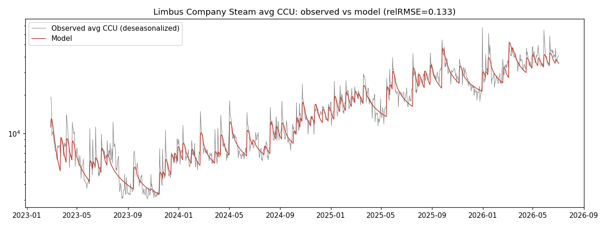
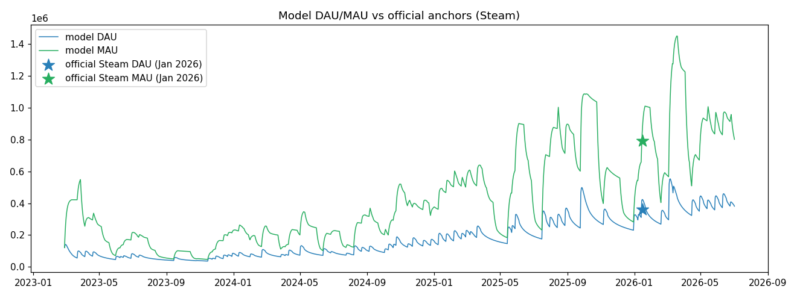
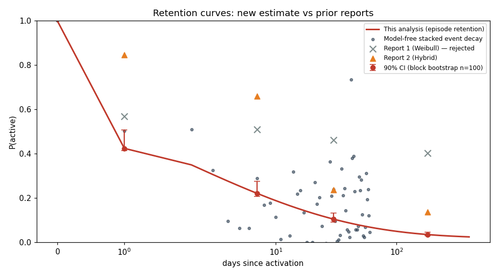
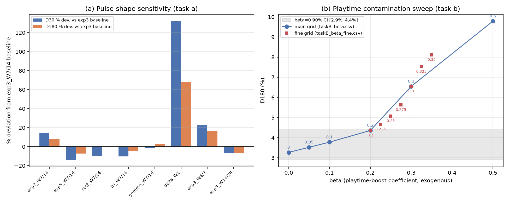
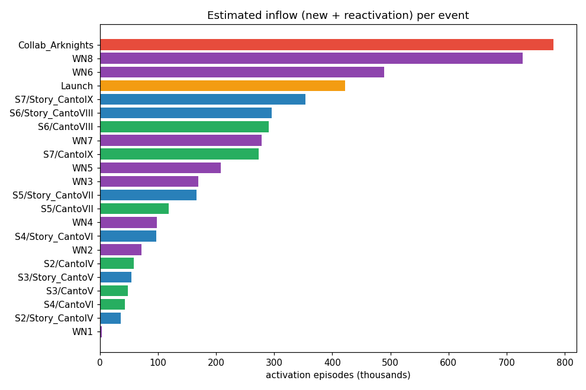
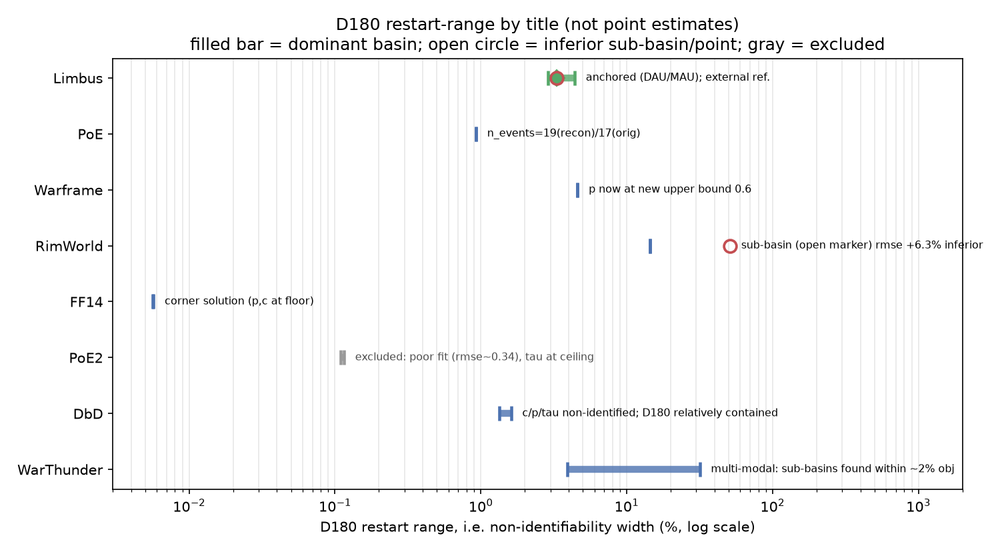

# How Much Retention Can Be Estimated from Public CCU and a Single Official Anchor? Back-Calculation on Limbus Company and a Multi-Title Generalization Test

**Author**: Hirotaro Nonaka (Riga Technical University) — ORCID: 0009-0009-6148-9974

**Keywords**: live-service games, retention, back-calculation, identifiability, customer-base analysis in noncontractual settings, public external metrics, sensitivity analysis

(Preprint v1.2-EN, 2026-07-15. English version of the Japanese draft v1.1; all numerical values are identical. Some explanatory prose placed in figure captions in the Japanese version appears in the body text here, per English-paper conventions. Japanese version on Jxiv; cross-references to be added after publication.)

---

## Abstract

We examine whether an outside analyst with no access to user-level telemetry can estimate the retention and inflow of a live-service game from a public concurrent-users (CCU) time series and a small number of official anchors alone. Applying a convolution decomposition structurally identical to epidemiological back-calculation to Limbus Company — a rare title whose official Steam DAU/MAU measurements were disclosed in an official broadcast — we estimate a three-layer structure: an activation-episode-basis D180 of 3.5% (3.0–6.6% including sensitivity analyses), a person-basis quasi-permanent attachment rate of ≈27% (20–39%), and an average of about 3.9 activation episodes per person over the ≈3.3-year observation window, validated by holdout prediction, synthetic-data recovery, and an independent cross-check. We then mechanically applied the same pre-registered, frozen procedure to seven titles lacking official anchors: the structural parameters of the retention kernel were unidentifiable in every title, and this non-identifiability was invisible to goodness-of-fit metrics and to multi-start convergence agreement — it became visible only through an explicit bound-relaxation diagnostic on the search ranges. The contributions of this work are the formal separation of episode-basis and person-basis retention, and the quantitative finding that disclosed anchors, not analytical sophistication, determine identifiability.

---

## 1. Introduction

One of the most important indicators of a live-service game's health is retention — the probability that a player who becomes active at some point is still active d days later. Operators can measure this directly from individual-level telemetry, but outside analysts, researchers, and investors have access only to public aggregates such as concurrent users (CCU) and to fragmentary figures the operator chooses to disclose. The question this study addresses is: **can an outsider without user-level logs estimate retention and event-driven inflow from a public CCU time series and a small number of official anchors alone?**

The course of this research was as follows. First, Limbus Company (Project Moon, released February 2023) is a title with exceptionally precise public figures — its official livestreams have disclosed measured Steam DAU/MAU. We first attempted to see how far retention estimation could go for this single title, using only SteamDB's daily CCU (1,222 days, about 3.3 years) and the official DAU/MAU anchor of January 2026. Second, we applied the epidemiological back-calculation framework — reverse-estimating an unobserved infection-time distribution from an observed onset series — through the structurally identical convolution CCU(t) = Σᵢ N(i)·R(t−i), and, somewhat unexpectedly, it worked: in holdout validation the model predicted official anchors unused in training within DAU −5.4% / MAU −3.5%, and its implied average playtime matched an independently back-calculated value. Third, a review of prior work showed that analyses of public game metrics have been limited to single-coefficient static regressions (level or first-difference OLS mapping CCU to MAU), and that no established method dynamically separates and recovers inflow and a survival function. Fourth, to test generalizability, we extended the method laterally to other Steam titles for which data could be procured.

**We state at the outset that this trajectory itself embeds a methodological concern.** The study followed the path of "developing the method on a title that happened to have unusually precise public figures and a persistent upward trend, then attempting generalization after the fact" — a selection-bias concern akin to post-hoc hypothesis construction (HARKing: hypothesizing after the results are known). To address it, the multi-title comparison methodology was fixed and frozen on principle before looking at the other titles' data, borrowing the logic of statistical pre-registration; every subsequent change was logged with its reason (§6). The multi-title comparison is positioned strictly as an exploratory test of the method's generalizability given that it worked on Limbus; we do not claim that the other titles' estimates deserve the same confidence as Limbus's.

This work makes two contributions.

1. **Methodological**: we apply a back-calculation-style framework that jointly estimates an unobserved arrival process (inflow) and an unobserved survival function (retention kernel) from public CCU plus a few anchors, and we quantify its conditions of applicability and its limits — including the fact that structural parameters become unidentifiable without anchors — through systematic sensitivity analyses and a bound-relaxation diagnostic.
2. **Conceptual**: we formally separate **episode-basis** retention (persistence of an activity episode; observable) from **person-basis** retention (attachment to the community; latent). The multi-title results demonstrate that ignoring this separation leads one to misread episode-basis differences as differences in title attachment when they in fact measure the periodic structure of content cycles (§7).

The peculiarity of Limbus itself — an upward trend sustained for more than three years, supported by repeated returns of its resident community — is discussed later together with the person-basis results (§5).

## 2. Related Work

Prior work relevant to this study falls into three streams.

**(1) Game retention research (assuming individual-level telemetry).** Bauckhage et al. (2012) showed across several commercial games' telemetry that player engagement decay is widely well-fitted by Weibull distributions, which motivates the Weibull shape of our kernel's short-term component. Note, however, that their object is the distribution of total playtime, which differs from the calendar-day survival rates we estimate. Periáñez et al. (2017) discussed the limits of simple parametric survival models for churn prediction in mobile social games and the superiority of ensemble methods; we reference this in anticipation of criticism of our parametric kernel, to which our design-level response is that under an external-metrics-only information constraint, data of the granularity needed to train flexible nonparametric methods simply does not exist. Lu (2002) is a methodological precedent for distribution comparison and robustness checking, which our pulse-shape sensitivity analysis (§5) follows. Hanner, Heppner, and Zarnekow (2015) reported that BG/NBD — a standard model for noncontractual customer-base analysis — did not work well for F2P games, important evidence that model choice in the game context is not obvious.

**(2) Customer-base analysis in marketing science (noncontractual settings).** This stream is formally closest to our problem. The BG/BB model of Fader, Hardie, and Shang (2010) is the ancestor of frameworks that formally distinguish "dormant" from "dead" customers as unobservable states; our episode/person separation is a translation of that distinction into the game context. Jerath, Fader, and Hardie (2016) showed that key customer-base quantities remain identifiable from repeated cross-sectional summary (RCSS) data rather than individual-level data — an empirical precedent for our central concern, identifiability from aggregates. McCarthy, Fader, and Hardie (2017) proposed valuing contractual businesses from publicly disclosed aggregate customer data, a problem setting nearly identical to ours — and their paper explicitly lists the extension to noncontractual settings as future work. Games are a canonical noncontractual setting (no observable cancellation event); **this study attempts to fill that gap**. Methodologically closest is McCarthy and Fader (2018), whose reverse-estimation of customer metrics for noncontractual e-commerce firms from public aggregates shares the spirit of our CCU decomposition.

**(3) Epidemiological back-calculation.** Back-calculation, systematized by Brookmeyer and Gail (1994), reverse-estimates the unobserved distribution of HIV infection times from the observed time series of AIDS diagnoses and the incubation distribution. Our CCU(t) = Σᵢ N(i)·R(t−i) — observed CCU as the convolution of unobserved inflow with a survival kernel — is structurally identical. The difference is that in epidemiology the incubation distribution (the kernel) is treated as known from external studies, whereas here the kernel itself is unknown and estimated jointly with inflow, regularized only by a few anchors and priors. This "both-sides-unknown" setting is the root of the identifiability problems discussed later (§6–7).

In summary: stream (1) presupposes telemetry unavailable to outsiders; streams (2) and (3) provide the reverse-estimation-from-aggregates framework but have not been applied to public game metrics (CCU). To our knowledge, no established method dynamically recovers inflow and a survival function from a public CCU series; this study is the first systematic attempt.

## 3. Method

### 3.1 Observation model and retention kernel

The observed series is daily average CCU. We first remove weekday seasonality as follows: take the centered 7-day moving average m(t) of the raw series y_raw(t); aggregate the ratio r(t) = y_raw(t)/m(t) by day of week; use the median per weekday as the coefficient s_w (w = Monday…Sunday); and set y(t) = y_raw(t)/s_w(t) as the adjusted series. The median (rather than the mean) makes the coefficients robust to event-day outliers. For Limbus these coefficients are roughly +30% on Thursdays (patch day), +11–14% on weekends, and −20% Monday–Wednesday. Below, y(t) denotes the adjusted series.

Adjusted CCU is identically linked to DAU via average playtime h (hours/day):

CCU(t) = DAU(t) · h / 24,   DAU(t) = Σ_{i≤t} N(i) · R(t−i)

where N(i) is the activation inflow on day i (new players plus reactivations from dormancy; hereafter "activation episodes"), and R(d) is the probability of being active d days after activation — the **episode-basis retention kernel**. We assume a two-layer mixture:

R(d) = (1−p) · exp(−(d/λ)^k) + p · c · exp(−d/τ),   R(0) = 1

The first term is Weibull-type decay of the general population (scale λ, shape k; k<1 is heavy-tailed); the second is an ultra-core stratum of population share p, active with daily activity rate c and decaying slowly on lifetime scale τ. Note that the long-term plateau level enters the observations essentially only through the product p·c, so identifying p and c separately is intrinsically difficult without anchors (demonstrated in §6.2). Monthly actives (MAU) are constructed by convolution with the monthly-activity kernel

A(d) = (1−p) · exp(−(max(0, d−29)/λ)^k) + p · exp(−max(0, d−29)/τ)

which approximates the probability of at least one active day within a 30-day window (A=1 for d ≤ 29; c does not appear in A because the ultra-core stratum is treated as monthly-active regardless of its daily activity rate).

Table 1 summarizes the main symbols and their physical interpretation.

**Table 1: Symbols and physical interpretation**

| Symbol | Definition | Physical interpretation |
|---|---|---|
| y(t) | Weekday-adjusted daily average CCU | Average concurrent users on that day |
| N(i) | Activation inflow on day i | Number of people who became active that day, whether new or returning from dormancy (episode basis) |
| R(d) | Retention kernel | Probability of being active d days after activation |
| λ, k | Weibull scale (days) and shape | Speed and shape of general-population departure: λ is the characteristic stay length; k<1 means heavy tails (the quick leave quickly; the longer one stays, the less likely one leaves) |
| p | Ultra-core population share | Fraction of activations that remain quasi-permanently |
| c | Ultra-core daily activity rate | Probability that a core member is connected on any given day (height of the long-term plateau) |
| τ | Ultra-core lifetime scale (days) | Core-stratum decay constant; longer than the observation window, only a lower bound is identifiable |
| h | Average playtime (hours/day) | Conversion factor in CCU = DAU·h/24 |
| β | Playtime-boost coefficient | Degree of extra play by existing users on event days (exogenous knob for sensitivity analysis) |

### 3.2 Inflow model and separable estimation via NNLS

Inflow is modeled as a constant term (Base) plus event pulses:

N(t) = Base + Σ_e a_e · s(t − t_e)

The pulse shape s is, in the reference specification, s_j ∝ exp(−j/3) (j = 0, …, W−1, normalized so Σs_j = 1), with width W = 7 days for regular events and 14 days for long events (launch, collaboration). Because of the normalization, the amplitude a_e is exactly the total activation count of event e (lowercase, to avoid confusion with the monthly kernel A(d); it corresponds to the NNLS solution vector a in the implementation). With the retention kernel fixed, predicted CCU is linear in the amplitude vector; we therefore construct the design matrix (Base column = cumulative sum of R; event columns = pulse convolved with R) and adopt a **separable estimator that solves all amplitudes analytically in an inner non-negative least squares (NNLS) step**. We choose NNLS for two reasons. First, non-negativity of amplitudes (counts of people) is a physical constraint in itself, and imposing it as a sign constraint is the most direct form of regularization (it removes unphysical negative-inflow solutions from the search space). Second, keeping the structure in which predictions are linear in amplitudes given a fixed kernel lets the inner subproblem be solved globally as a convex program, confining the outer nonlinear search to six parameters. Notably, cases in which this non-negativity constraint actually binds were observed in the multi-title verification, and the binding itself carries diagnostic information (§6.2). Dividing each row by the observation y(t) to normalize the target to unity makes the loss the sum of squared relative errors Σ_t ((ŷ(t)−y(t))/y(t))², treating equally the whole span of a series whose level changes by more than an order of magnitude over three years.

For the Limbus estimation proper, official anchor rows are appended: one row each for the January 2026 monthly average DAU (=360,639, σ=5%) and MAU (=792,250, σ=3%), plus penalty terms for the DAU/MAU ratio ~ N(0.455, 0.02) (official measurement) and playtime h ~ N(2.2, 0.2) (prior).

### 3.3 Outer optimization and search ranges

The kernel parameters and playtime θ = (ln λ, k, p, c, ln τ, h) are optimized in the outer loop with Powell's method and refined with Nelder–Mead (quadratic penalty on leaving the search range). The search ranges (BOUNDS) are λ ∈ [0.1, 30] days, k ∈ [0.08, 1.5], p ∈ [0.001, 0.4], c ∈ [0.2, 1.0], τ ∈ [200, 6000] days, h ∈ [1, 4] hours. These ranges were not derived from theory; they are practical settings based on the vicinity of the original Limbus estimates and operational plausibility (stay scales of days to weeks, core lifetimes up to several times the observation window, playtime of 1–4 hours, etc.). **That the search-range settings can themselves distort the estimates — solutions pinned at a boundary converge to the same value from multiple starting points and thus masquerade as stable — is one of the findings of this study**, and is treated systematically by the diagnostic of §3.5(c) and the verification of §6. Goodness of fit is reported as relative RMSE = √(mean(((ŷ−y)/y)²)). This value serves as a comparative metric across specifications and titles, not as evidence of absolute adequacy — the validity of the estimates rests on external agreement (anchor prediction, synthetic-data recovery; §5.1), and, as §6.2 shows, RMSE says nothing about identifiability. Uncertainty is assessed by 90% CIs from a block bootstrap (100 replicates).

### 3.4 Extensions for multi-title application (pre-registered frozen protocol)

The procedure for applying the method to other titles was frozen before looking at their data (addressing the concern of §1):

1. **Mechanized event detection**: since no hand-curated calendars exist, days on which the weekday-adjusted series exceeds 1.35 times its 21-day rolling median are event candidates, selected greedily with a minimum gap of 5 days. The head of each series is treated as a launch with a 14-day (long) pulse.
2. **Left-censoring correction**: SteamDB's average-CCU column exists only from 2022-09-24, so veteran titles carry an existing population at the start of the observation window. We (i) add an initial-stock regressor exp(−t/τ) (stock assumed core-dominated, τ shared with the kernel) as an NNLS column, and (ii) exclude the first 90 days from the loss (burn-in). Neither is applied to the title observable from its actual launch (PoE2, launched 2024-12-06).
3. **No anchors**: since no official DAU/MAU measurements exist, no anchor constraints are used — only the prior on h. Without anchors, h is not identified by the data (relative RMSE is exactly invariant to h, verified numerically); we therefore treat h as a value fixed at the prior center 2.2 and state explicitly that its uncertainty propagates into the inflow scale (Base, stock, amplitudes) as 1/h.

Whenever a deviation from the frozen protocol became necessary, it was logged, distinguishing "post-hoc method choice" from "forced by data constraints" (§6). Note also that freezing can be fully rigorous only at the level of the implementation (the published code); a specification written in natural language has limited granularity (see §8(6) for recorded instances).

### 3.5 Design of the sensitivity analyses and the identifiability diagnostic

The method's vulnerabilities are quantified along three lines. **(a) Pulse-shape sensitivity**: all parameters are refit under the same procedure for 9 specifications — 7 shapes (exp2/exp3/exp5/rectangular/triangular/gamma-type/delta) at the reference width, plus the reference shape exp3 at 2 additional widths (4/7 and 14/28 days). **(b) Playtime contamination**: with CCU(t) = DAU(t)·(h/24)·(1+β·g(t)) (g the unit-peak pulse profile over event windows), the playtime boost β of existing users on event days is swept exogenously, tracking the share of excess CCU reclassified to playtime and the resulting change in retention estimates. **(c) Bound-relaxation verification**: after fitting, every parameter is mechanically checked against the upper and lower limits of its search range; if any parameter is pinned at a boundary, the range is relaxed and the model refit, classifying the outcome as "does not move when relaxed (genuinely stable)", "moves with the boundary (apparent stability)", or "parameters move while the objective stays essentially equal (flat ridge = non-identified)". This diagnostic rests on the principle that multi-start convergence agreement is evidence of identifiability only when the optimum lies in the interior of the search range (§6).

**Note (the two fits used in this paper)**: the numbers in this paper derive from two fits. The reference values of §5.1–5.4 (relative RMSE = 0.133, D180 = 3.5%, etc.) come from the original analysis itself, whereas the sensitivity analyses of §3.5 and the multi-title verification of §6 are based on a fit from our independent code reimplementation of the original analysis, whose reproduction scripts had not been preserved. The reimplementation was validated as follows: plugging in the parameters recorded in the original analysis yields a relative RMSE of ≈0.131 (vs. the recorded 0.133, a ≈2% difference), and the refit retention metrics differ from the recorded ones by about 1% for D1, 5% for D7, 9% for D30, and 7% for D180 (reimplementation baseline D180 = 3.27%). All relative changes (Δ%) in the sensitivity analyses are reported against this reimplementation baseline.

## 4. Data

### 4.1 Limbus Company

We use SteamDB's daily average CCU (the "Average Players" column) from 2023-02-27 to 2026-07-02 — 1,222 days after dropping the first day and the incomplete final day. The peak column ("Players") is about 1.4× the average; since the identity CCU = DAU·h/24 holds only for average CCU, the peak column is not used. The event calendar comprises 22 labeled events confirmed from official information (1 launch, 6 season starts, 6 story conclusions, 8 Walpurgis Nights, 1 collaboration) plus 49 unlabeled major updates found by threshold detection (same rule as §3.4), for a total of 71. The anchor is the Steam-series endpoint (as of January 2026: DAU = 360,639 / MAU = 792,250, DAU/MAU = 45.5%) of the per-platform DAU/MAU time-series charts disclosed in the 3rd Anniversary & Roadmap livestream (2026-02-27). The MAU chart's x-axis labels are offset by about six months due to a presenter error (the final month reads 25-07 but is in fact 26-01); the correspondence was verified against the other series. Charts of the same kind were also disclosed in the broadcasts of 2024-11-22, 2025-02-26, 2025-06-13, and 2025-11-14 — the DAU/MAU levels and their ratio are disclosed recurrently — but only this single point is used in fitting; the 5 Total-MAU endpoints (2024-10 to 2026-01) serve only as consistency checks (§5.1). The person-basis estimation (§5) uses AppBrain's estimate of 2.2M cumulative Android downloads (±30% propagated). This ±30% is not an error metric provided by AppBrain but a conservative band assumed by this study; only its order-of-magnitude plausibility is checked against the rating-count ratio and the recent-download/MAU ratio (§8(3)).

### 4.2 Data for the multi-title comparison

The comparison set is Path of Exile, Path of Exile 2, Warframe, War Thunder, Dead by Daylight, FF14, and RimWorld (Project Zomboid was excluded at the source-verification stage — see ④ below). Since SteamDB's average-CCU column exists for all titles only from 2022-09-24, the six titles other than PoE2 are left-censored (correction of §3.4 applied). As an auxiliary source we examined raijin.gg archives (via the Wayback Machine, as of February 2026), but its CCU-type data agree with SteamDB's peak CCU within 1–2% error — **it is a repost of official Steam CCU, not an independent estimate**. The only information unique to raijin is its cumulative estimated copies sold, which we use solely as an order-of-magnitude consistency check on the model's Base inflow, via the OLS slope over the most recent 30-day window (the naive two-point difference underestimates the slope by about 24% due to retroactive recalibration noise and a stalled tail, and is therefore not used).

### 4.3 Classification of information sources

Because the reliability of external estimates depends strongly on the nature of the source, we classify all sources used into four categories.

| Category | Nature | Sources and titles |
|---|---|---|
| ① Official statements / IR disclosures | Figures announced by the company itself | Limbus: measured Steam DAU/MAU from official broadcasts (used as the anchor). DbD: Behaviour CEO statements (70M cumulative players, 1M daily across all platforms). FF14: Square Enix IR (30M cumulative registered users as of January 2024) — the latter two are reference values, not used in fitting |
| ② Review-count-based estimates | Sales back-calculated from review counts etc. (SteamSpy/Boxleiter family) | raijin.gg (used uniformly as the control-group source for the 7 titles; copies-sold slope only). SteamSpy and Gamalytic for range checks only |
| ③ Play Store bucket interpolation | Time interpolation of displayed bucket widths | AppBrain (Limbus only; denominator of the person basis) |
| ④ Secondary aggregations of unknown provenance | Aggregator sites with no methodology of their own | icon-era.com (Project Zomboid) → **rejected** (PZ excluded from the comparison) |

The sources used for Limbus (①③) and those available for the other titles (②) differ in quality and independence. This asymmetry is one reason the multi-title comparison is positioned as exploratory (§1).

## 5. Results — Limbus Company (single-title deep dive)

### 5.1 Fit and validation

The relative RMSE of the full-period fit is 0.133 (after weekday adjustment; 0.131 for the reimplementation baseline used in the §3.5 sensitivity analyses). Figure 1 shows the fit of the model to observed CCU; Figure 4 shows the model's DAU/MAU trajectories against the official anchors. The model's DAU/MAU ratio is 0.451 (official 0.455); January 2026 DAU = 344k (−4.6% vs. the measured 360,639) and MAU = 796k (+0.5% vs. 792,250). Validation was threefold. (i) **Holdout**: training only on data through 2025-06-30 (also excluding the January 2026 anchor, which lies in the test period, from the loss) and predicting the following year, the test-period relative RMSE is 0.126, on par with the training period (0.136), and predictions of the unused anchors are DAU −5.4% / MAU −3.5%. (ii) **Synthetic-data recovery**: generating CCU with 10% multiplicative noise from the estimated parameters and re-estimating from perturbed initial values recovers D1/D7/D30/D180 within 1–3 points. (iii) **Agreement with an independent back-calculation**: the model's average playtime of 2.23h (CI 2.01–2.38h) matches 2.19h back-calculated independently from official DAU and CCU. Before the anchor was introduced, an identifiability failure allowed both D180 = 40% and 13.6% for the same CCU; the anchor's introduction resolved it — **this observation, that the presence or absence of a single anchor decides identifiability, foreshadows the central result of the multi-title verification (§6)**.

The mechanism by which the anchor restores identifiability can be described as the resolution of at least two degeneracies. First, a scale degeneracy: without anchors the NNLS solution scales exactly as 1/h and relative RMSE is exactly invariant to h (verified numerically; §3.4) — the absolute level of inflow is not determined by the data, and a single DAU anchor pins it. Second, a shape degeneracy: within the model the DAU/MAU ratio is governed primarily by the shapes of the kernels R and A (it is invariant to the overall inflow scale), so the ratio prior N(0.455, 0.02) constrains how short-term decay and the long-term plateau mix. The elimination of the two previously coexisting prior estimates is well explained by these constraints.

**Figure 1**: Weekday-adjusted daily average CCU (gray: observed) and the model (red), 2023-02 to 2026-07, log vertical axis. The model tracks both the biweekly content waves with their decay and the 3-year-scale upward trend. Relative RMSE = 0.133.

**Figure 4**: DAU (blue) and MAU (green) trajectories constructed by the model, and the official measured anchors of January 2026 (stars). Only this single anchor point is used in training, yet it constrains the level of the entire trajectory (see the threefold validation in §5.1).

### 5.2 Episode-basis retention and its sensitivity

| Metric | Point estimate | 90% CI (block bootstrap, 100 replicates) |
|---|---|---|
| D1 | 0.423 | 0.414–0.506 |
| D7 | 0.223 | 0.206–0.275 |
| D30 | 0.107 | 0.091–0.132 |
| D180 | 0.035 | 0.029–0.044 |
| D365 | 0.025 | — (interval estimate not reported in the original analysis) |

Figure 2 shows the estimated retention curve together with a model-free stacked decay and the prior estimates. The estimated kernel is λ=1.50, k=0.30, p=0.023 (CI 0.021–0.055), c=0.90, τ≈6,000 days, h=2.23h. What the data prefer is not "two layers split at a one-month wall" but heavy-tailed Weibull decay with shape k≈0.3, on which rides a quasi-permanent ultra-core stratum of about 2.3% of the population with a daily activity rate of about 90%. τ sits at the upper search limit and has no resolution beyond "no visible decay within the observation window" (only a lower bound is identifiable).

**Figure 2**: Episode-basis retention curve (red: this estimate; error bars: 90% CI). Gray dots are the model-free stacked decay of major events (an upper bound, since inflow from subsequent content contaminates it); × and ▲ are the rejected prior estimates (single-layer Weibull and hybrid, respectively). Horizontal axis: days since activation (log).

These point estimates are never presented alone; the sensitivity results are always attached:

- **Pulse-shape sensitivity (§3.5(a))**: D180 stays within 3.0–3.8% for the 8 non-delta specifications, entirely inside the reported 90% CI (2.9–4.4%); relative deviations from the reimplementation baseline 3.27% span −7.4% to +16.2%, with the six reference-width specifications (the baseline plus five shape variants) staying within −7.4% to +8.2% and the +16.2% upper end coming from the half-width specification. D30 moves by −14% to +23% (0.084–0.120 on the reimplementation baseline 0.098) — the temporal spread of arrivals partially confounds with early retention: assuming a narrower pulse pushes the explanation of CCU peaks toward longer stays, and a wider pulse pushes it toward early churn. Fit quality clearly prefers front-loaded decaying shapes (exp2/exp3), with rectangular worst (RMSE 0.154): the data themselves support "arrivals concentrated on event day one and decaying". Delta (all arrivals on day one) fits best (RMSE 0.119) but is a degenerate case in which D180 inflates to 5.5%: with the arrival distribution's degrees of freedom removed, their explanatory power is absorbed into the retention parameters, and the implication that "no one arrives after day one of a 7-day event" contradicts operational reality. We use it only as corroboration of an upper bound: D180 ≤ 5.5% even under the extreme zero-spread assumption.
- **Playtime contamination (§3.5(b))**: this bias is one-directional (upward). The larger β, the more excess CCU is reclassified as playtime, the smaller the estimated inflow, and the longer each activation must persist to satisfy the MAU anchor. D180 rises by +16% at β=0.1 (3.8%, within the CI), +33% at β=0.2 (4.4%, the CI upper limit), and reaches **D180 ≤ 6.6%** at the plausible cap β=0.3 (an extra boost on major events of the same magnitude as the +30% ordinary patch-day effect already removed by weekday adjustment). Relative RMSE is essentially flat at 0.127–0.134 across β=0–0.5: **β cannot be identified from the CCU series alone** — a structural limit addressable only by sensitivity analysis. A fine grid over β=0.2–0.35 in steps of 0.025 shows this transition to be a smooth, single-basin continuous deformation (D1, total activations, and all parameters monotone); an inferior second basin appears at β≥0.325 but does not affect the β≤0.3 sensitivity range.
- **Combined range**: baseline D180 = 3.5% (90% CI 2.9–4.4%); 3.0–3.8% varying pulse shape alone; up to 6.6% allowing playtime contamination up to β=0.3. **The conservative combination of the two independently evaluated sensitivities gives 3.0–6.6%, but note this is not a joint worst case of both biases.**

Figure 5 gives an overview of both sensitivity analyses.

**Figure 5**: Combined sensitivity analyses. (a) Percent deviation of D30 (blue) and D180 (orange) from the reference specification (exp3, widths 7/14) across the 9 pulse-shape specifications; only delta (single-day concentration) deviates strongly — a degenerate case (§5.2). (b) D180 (%) versus the playtime boost β. Circles: main grid (β=0–0.5); squares: fine grid (β=0.2–0.35); gray band: 90% CI at β=0 (2.9–4.4%). The transition is smooth, remaining within the CI band up to β≈0.2.

### 5.3 Per-event inflow and interpreting "Base = 0"

Figure 3 shows estimated inflow per labeled event. Mean activations by event type (per occurrence, 90% CI): collaboration 781k (589k–974k), Walpurgis Night 264k (208k–313k), story conclusion 168k (130k–214k), season start 142k (116k–173k). The event-independent constant inflow (Base) collapsed to 0 — but this does not mean "no organic inflow exists": Base is perfectly collinear with the 49 unlabeled biweekly major updates (5.68M activations in total), and the substantive interpretation is that "virtually all of Limbus's inflow arrives as waves of content updates, and a constant organic inflow cannot be identified". Note that the playtime-contamination bias (§5.2) biases each event's absolute value upward.

**Figure 3**: Estimated activation inflow per labeled event (new + returning, in thousands). The collaboration, Walpurgis Nights 8 and 6, and launch rank highest. Absolute values are biased upward by playtime contamination (§8(1)).

### 5.4 Person-basis retention: the three-layer answer

Total activation episodes reach about 10.76M — an order of magnitude above the Steam MAU of 0.79M — meaning repeated returns by the same people dominate. Multiplying AppBrain's cumulative Android download estimate of 2.2M (±30% propagated throughout) by the official MAU ratio (Steam/Android = 1.264) gives ≈2.78M (1.95M–3.61M) unique lifetime Steam players. From this:

| Case | Steam uniques | Person-basis D180 (≈ permanent attachment) | Episodes/person |
|---|---|---|---|
| DL−30% | 1.95M | 38.6% | 5.5 |
| DL=2.2M | 2.78M | **27.3%** | 3.9 |
| DL+30% | 3.61M | 19.9% | 3.0 |

Fitting the person-basis monthly attachment kernel, the decay constant degenerates to its lower bound and the curve becomes nearly a step function — i.e., "most leave within the first 1–1.5 months, and the survivors show essentially no decay within the observation window". In sum: **(1) episode-basis D180 = 3.5% (3.0–6.6%) — a single activation does not persist long. (2) Person-basis D180 ≈ 27% (20–39%) — about 27% of unique installers remain attached quasi-permanently. (3) The attached repeat on average about 3.9 activation episodes per person (3.0–5.5) over the full observation window (≈3.3 years).** The structure sustaining Limbus's 3+-year upward trend is explained by these three layers: growth is driven not by the level of new acquisition but by the repeated returns of the permanently attached being bundled into content waves (10.76M activations against 2.78M uniques). Of the three layers, (2) and (3) depend on the AppBrain estimate (±30%), on the assumption of equal MAU/unique ratios across platforms, and on the approximation that unique inflow is proportional to episode inflow, and are thus one notch less certain than (1); they are structured to be replaceable if an official cumulative account count is ever disclosed. Moreover, the person-basis ratio is by construction an average of S(τ) weighted by the age composition of inflow and thus depends mechanically on the shape of the inflow history — the structural limitation that prevents carrying this value alone into cross-title comparisons is detailed in §8(3).

## 6. Results — seven-title generalization test

### 6.1 Overview and exclusion

The frozen protocol of §3.4 was applied mechanically to PoE, PoE2, Warframe, War Thunder, DbD, FF14, and RimWorld. All deviations from the frozen design were forced by data constraints, not post-hoc method choices (left-censoring correction, h fixed without anchors, mechanized event detection; §3.4).

Of these, **PoE2 is explicitly excluded as out of scope**: the nonstationarity of its enormous early-access launch decay is fundamentally incompatible with the stationary-kernel assumption, and its fit remained the worst of all titles (relative RMSE ≈ 0.34). PoE2's numbers are retained for the record but are not cited anywhere below. This exclusion was not a criterion pre-defined in the frozen protocol; it is a post-hoc decision made after observing the fit. Following the protocol's own rule (log every post-hoc change and retain the numbers), we state the grounds and the timing of the exclusion here, and PoE2's numbers remain in the table (§6.3) and in the published data.

### 6.2 Discovery and diagnosis of boundary pinning

Mechanically checking the raw values of the initial fits against the search ranges revealed that λ (upper limit 30 days) and p coincided exactly with their boundaries in four titles, and, in the course of relaxation, that **the long-term plateau coefficient c was pinned at a boundary in all seven titles**. Applying the diagnostic protocol of §3.5(c) (two rounds of bound relaxation + multi-start + independent audit):

- The λ pinning was an artifact of insufficient search range: on relaxation, λ moved to interior values (40–145 days) in three titles, and D180 moved by +174% for War Thunder and +41% for RimWorld — **with relative RMSE essentially unchanged in every case**: goodness of fit cannot distinguish before from after relaxation.
- For War Thunder, D180 ranges from 0.039 to 0.317 along a flat ridge of essentially equal objective values (RMSE within +1.0%) — the aggregate D180 itself is non-identified.
- For Warframe, p and c are jointly non-identified (the long-term level enters almost only through the product p·c), and D180 moved with each relaxation (−25% vs. the initial version).
- For FF14, every restart converged to a corner solution with both p and c at their lower bounds. The tiny spread across restarts is, in this case, no evidence of stability — **multi-start convergence agreement is evidence of identifiability only when the optimum is interior to the search range**.
- The zero estimates of the left-censoring stock term and of Base are not indeterminacy from lack of information but **boundary solutions with the non-negativity constraint binding** (verified directly: removing the constraint makes the coefficients negative). Their robustness comes in three tiers: DbD's stock=0 is a robust boundary solution invariant to ±5% perturbations of τ; PoE's Base=0 and RimWorld's stock=0 are thin-margin (their signs flip under perturbation); War Thunder/FF14/Warframe have robust interior stock (110k–340k).

### 6.3 Two-layer identifiability assessment (final)

The diagnosis resolves into two layers. **The structural parameters (λ, k, p, c, τ) are effectively unidentifiable in all seven anchor-less titles** (boundary pinning, corner solutions, flat ridges, or p–c coupling). The robustness of the observable D180, by contrast, differs by title:

| Title | Structural parameters | D180 robustness | Citable form |
|---|---|---|---|
| PoE | Non-identified (c chases its boundary; p moves strongly; only τ=249 days is exceptionally identified) | Single solution but bound-sensitive (+14% under c relaxation) | Only the qualitative "about one order of magnitude below Limbus" |
| FF14 | Non-identified (p, c corner solution) | Only "≈0" is robust | Only the qualitative "effectively zero" |
| PoE2 | Non-identified (τ splits across restarts between its lower and upper limits) | — | **Excluded (§6.1); not cited** |
| DbD | Non-identified (c/p/τ sweep their whole ranges at essentially equal objective) | **Robust**: a band of 1.33–1.62% (insensitive to structural sweep) | Citable as a band |
| Warframe | Non-identified (p–c coupling) | Not robust (−25% under relaxation) | Not cited |
| RimWorld | Non-identified (c reaches its physical upper limit 1.0) | Tight within the dominant basin (≈14%; the inferior basin is +6.3% worse in RMSE) | Only as a reference value conditional on the single detected event being correct |
| War Thunder | Non-identified (flat ridge) | **Non-identified** (0.039–0.317) | No point estimate cited |

Only Limbus (anchored) is identified down to the structural parameters (the resolution of the identifiability failure in §5.1); **kernel decompositions are reported for Limbus only**. Figure 6 visualizes this two-layer assessment.

**Figure 6**: Per-title multi-start ranges of D180 (horizontal bars, log axis) — a presentation of non-identifiability width, not point estimates. Limbus (top) collapses to a point estimate + 90% CI thanks to its anchor. Filled bars: restart range within the dominant basin; open circle: inferior sub-basin (RimWorld: +6.3% worse RMSE); gray: excluded (PoE2). War Thunder's bar spans about an order of magnitude while DbD stays in a narrow band. Note, however, that **a narrow range is not automatically evidence of identification** — FF14's extremely narrow range is the product of corner-solution convergence (§6.2).

### 6.4 Auxiliary consistency check (raijin copies sold)

Each title's Base inflow estimate was checked against the regression slope of raijin.gg's cumulative estimated copies sold (§4.2). Since activations include returns, ratios above 1 are expected; the ratio stayed within one order of magnitude for five of six titles (unchanged when accounting for Base shifts under relaxation). The exception, PoE (0.1×), reduces to a single explanation: PoE's Base degenerates to ≈0 by the nature of its league system, the observation window (January–February 2026) fell in a between-league trough where model inflow consisted only of pulse tails, and the appropriateness of copies sold as a comparison target is itself questionable (review-count-based estimation for an F2P title, with confirmed retroactive recalibration noise — §4.2).

### 6.5 Main conclusion: identifying the conditions under which the method works

The main conclusion of the multi-title verification is not any individual title's retention value but the **identification of three conditions for the method to work**: (i) dense event pulses; (ii) observation from launch (no left-censoring); (iii) at least one official anchor. None of the seven comparison titles satisfies (iii); only the excluded PoE2 satisfies (ii); and (i) is a matter of degree rather than a binary — detected event counts span a spectrum from PoE (19) to War Thunder/RimWorld (1 each). Event count and identifiability correspond clearly at the spectrum's ends (the two one-event titles are structurally fully non-identified — though RimWorld's D180 survives conditionally on its single detected event — while 19-event PoE has a unique solution), but **the correspondence is non-monotonic in between**: DbD (6 events) has the most robust D180 band among non-Limbus titles while Warframe (7 events) is non-robust, because identifiability also depends on structural confounds of the kernel (such as p–c coupling), not just event density. What can be said with certainty is that **only Limbus, with its official DAU/MAU broadcast, satisfies all three conditions simultaneously** — quantitatively vindicating the §1 disclosure that Limbus was an exceptionally favorable case.

The comparison among the (conditionally) readable titles is itself interesting: the low episode-basis D180 of PoE (about an order below Limbus) and FF14 (effectively zero) is consistent with league/expansion cultures of "play for 3–4 months and step away", showing that cross-title comparison of episode-basis D180 measures the periodic structure of content cycles rather than title longevity. This implication is developed in §7.

## 7. Discussion

### 7.1 Why the episode/person separation is conceptually necessary

The cross-title comparison of §6 demonstrates how misleading it is to read episode-basis retention differences as differences in title attachment. Among the titles whose episode-basis D180 is (conditionally) readable, PoE sits about an order of magnitude below Limbus and FF14 is effectively zero. Read naively, "PoE and FF14 fail to retain players" — the opposite of reality: both are canonical examples of decade-plus retention. What is actually happening is that the league system (PoE) and expansion cycle (FF14) have institutionalized a rhythm of "play for 3–4 months, then step away" as the culture, so that **a single activation episode not persisting until the next major content drop is the designed normal state**. Episode-basis D180 measures the periodicity of content cycles, not the longevity of titles.

The correspondence between title characteristics and model behavior is also suggestive (the following is interpretation based on observed model behavior; we have not verified it against any title's internal data). The two conditions that mattered in practice — event-pulse density and the degree to which CCU synchronizes with content updates — are both functions of a title's operating model. The inflow waves decompose cleanly for biweekly-updating Limbus and league-based PoE, whereas for continuously operated War Thunder with its smooth series, or buy-to-play RimWorld with its diffuse content waves, there simply are no waves in the series to decompose. That is, **the applicability of this method is itself an indicator of a title's operating rhythm — whether it runs wave-style live-service operations**.

Limbus's three-layer answer (§5.4) shows that the separation is not merely definitional fastidiousness. Looking only at episode-basis D180 = 3.5% (3.0–6.6%), it is a fast-churn title; on the person basis, about 27% (20–39%) of unique installers are quasi-permanently attached and average about 3.9 activations each over the observation window. From identical data and an identical model, changing only the aggregation basis correctly yields both "3.5%" and "27%" — numbers an order of magnitude apart. What an external-metrics analysis ought to report is neither one alone but **both values and their linkage** (episodes per person). Cross-title person-basis comparison would require multi-point estimates of each title's cumulative installs (the source constraint of §4.2) and was not attempted beyond Limbus; the person-basis metric also carries its own limitation of mechanical distortion by the age composition of inflow (§8).

In this context, the "Base = 0" estimate (§5.3) deserves its own discussion. Read literally it says "no organic inflow exists"; the correct reading is an identification problem. Limbus has shipped biweekly major updates nearly without fail for over three years, and this cadence functions like a metronome: even if constant organic inflow existed, its arrival would synchronize with and be absorbed into the content waves — which is exactly why the constant-inflow column is perfectly collinear with the 49 biweekly update pulses. Base = 0 therefore means not "Limbus has no organic inflow" but **"under this operating rhythm, an outside observer has no means of distinguishing organic inflow from content-driven inflow"**. This reading is consistent with the person-basis repeated-return structure (about 3.9 "breaths" per person over the observation window) — and since the person-basis estimate is derived independently from the comparison of total activations with the AppBrain denominator, this is a consistency check between independent outputs, not a circular argument: if most inflow is returning members of the attached pool and content updates set the timing of returns, it is no surprise that the inflow series has no shape other than that of the content waves. Limbus's growth is thus pictured not as a steady stream of new acquisition but as **a mechanism that periodically re-activates a permanently attached pool with content waves** — the inflow-side mirror image of the episode/person separation of pillar 1.

### 7.2 Structural non-identifiability without anchors: implications for outside-in analysis in general

The most important methodological finding of this study, established by the bound-relaxation verification (§3.5(c), §6.2), is this: **without a single official anchor, the structural parameters of the retention kernel could not be identified in seven titles out of seven.** Moreover, this non-identifiability shows up neither in ordinary goodness-of-fit metrics nor in naive multi-start convergence — solutions pinned at boundaries converge to the same value from many starts and thus fake stability. There was a real case (War Thunder) in which, under the same observed series, the same model, and essentially the same RMSE, D180 ranged from 0.039 to 0.317. Conversely for Limbus, introducing just one DAU/MAU anchor (plus a ratio prior) eliminated the two prior estimates (D180 = 40% and 13.6%) that anchor-less CCU could not tell apart (§5.1). Identifiability is determined almost entirely not by the quantity of data but by **what the operator has disclosed**.

This structure is not unique to game analytics. Attempts to estimate unobserved internal quantities from public aggregate indicators — inferring downloads from store ranks in the app economy, or recovering latent customer-funnel variables from aggregate data in marketing science — face the same identification gap between an observed aggregate series and the latent structure one wants, and connect to the concerns of disclosure theory in asking what voluntary corporate disclosure renders identifiable. We do not claim this study contributes to disclosure theory, but **the verification design quantifying how much a single disclosed anchor changes an outsider's estimation capability (frozen protocol + bound-relaxation diagnostic) may be transferable to empirical work on questions of that type**. At minimum, it offers game-analytics practice three concrete lessons: (1) retention estimates from external metrics alone must never be presented without stating whether official anchors were available; (2) using multi-start convergence agreement as evidence of stability presupposes verifying that the solution is interior to the search range; (3) goodness of fit (RMSE) says nothing about identifiability.

## 8. Limitations

**(1) Playtime contamination (the largest systematic error).** The model cannot distinguish existing users playing longer on event days from inflow. Reclassifying part of event-day excess CCU as existing users' extra playtime (β=0.1, 0.2) revises D180 upward to 3.8% and 4.4%, reaching 6.6% at the plausible cap β=0.3. The CCU series cannot identify this reclassification rate (relative RMSE flat at 0.127–0.134 for β=0–0.5). Event-inflow absolute values are therefore biased upward and retention downward; the estimates in this paper are conservative (lower-side) with respect to this bias. The most promising resolution is an external point free of playtime assumptions (e.g., digitizing officially streamed DAU charts), noting that digitization itself carries reading error (potentially large on log-scale charts).

**(2) Specification dependence of pulse shape.** D180 moves within about ±8% under shape changes at the reference width, and within −7% to +16% once width specifications are included (all inside the reported 90% CI). D1/D7/D30 carry a −14% to +23% specification dependence due to confounding with arrival spread; these metrics are meaningless unless accompanied by shape-sensitivity bands.

**(3) Structural limitation of person-basis retention.** The "person-basis retention" in this study is not a direct estimate of the true survival function S(τ) but an average of S(τ) weighted by the age composition of inflow. If a title's inflow history is skewed toward old cohorts, this ratio mechanically declines even when individual players' true loyalty is unchanged. Conversely, in titles where expansions or seasonal systems periodically re-engage existing accounts, dormant returns raise only the numerator while the denominator (cumulative installs; reinstallation does not increase it) stays fixed, so the ratio can even improve with age. Cross-title comparisons on this metric may therefore reflect the shape of inflow histories rather than true community attachment. Furthermore, the denominator (cumulative install estimates) itself varies severalfold across sources (e.g., RimWorld: 5–10M by SteamSpy vs. 1.4–1.5M by PlayTracker). Acknowledging this, we based cross-title comparison on cohort-age-normalized measures, propagated ±30% through all Limbus person-basis computations, and treat no single point estimate as authoritative.

**(4) Search ranges and identifiability.** As §6.2 shows, in anchor-less settings the structural parameter estimates depend on the search-range settings, and boundary-pinned solutions behave as if stable. This study diagnosed and disclosed the issue via bound-relaxation verification; conversely, any external estimate that has not undergone such a diagnostic — including the initial non-Limbus estimates within this study — is permanently exposed to the same danger. Even for Limbus, τ (ultra-core lifetime) has no resolution beyond "no visible decay within the observation window" (lower bound only), and h is not identified by the data absent anchors.

**(5) Event-calendar assumptions.** The collaboration event (the Arknights collaboration) is confirmed to have run 2025-09-25 to 10-23, about four weeks, whereas the frozen calendar assumes a 14-day window — roughly half the true length. Doubling every event window changes D180 by only −6.8% (inside the CI; §5.2), so the impact of under-widthing this single event is bounded well inside that. Event detection for the multi-title verification is the mechanical application of a frozen threshold, and errors in the dates or magnitudes of detected events propagate through the whole model (this dependence is total for titles with only one detected event — the reason RimWorld's D180 is kept as a conditional reference value).

**(6) Reproducibility granularity.** Although the multi-title methodology was pre-frozen, verification uncovered two places where the frozen specification's granularity did not guarantee exact reproduction (the merge rule for boundary cases of the minimum-event-gap rule, and the pipeline settings of the pre-exclusion initial PoE2 fit). Both were confirmed to have no effect on numerical conclusions, but we record the lesson: freezing a specification does not guarantee exact reproducibility if the specification is written too coarsely. All results in this paper can be regenerated from the published reproduction scripts (core.py, task_b.py, task_c.py, stock_collinearity.py), available at https://github.com/Hirotaro-Nonaka/limbus-retention-backcalc

## 9. Future Work

**Systematic study of disclosure and identifiability.** Systematizing the connections suggested in §7.2 — disclosure theory, the app-economy rank-estimation problem, latent funnel variables in marketing science — and quantifying across domains how much a single disclosed anchor changes outsiders' estimation capability is a natural extension of this study's verification design (frozen protocol + bound-relaxation diagnostic).

**Mathematical characterization of the stock/Base collinearity.** The collinearity between the left-censoring stock term and the Base term (after burn-in, the Base column's kernel degenerates to pc·exp(−t/τ), an affine transform of the stock column) is confirmed numerically, but a mathematical characterization of exactly which event configurations and observation windows produce strict linear dependence remains open. A formalization would allow judging in advance for which titles left-censoring correction can work.

**Extending the person basis to multiple titles.** Extending the currently Limbus-only person-basis estimation requires multi-point estimates of each title's cumulative installs (abandoned here due to the source constraints of §4.2). Collecting sparse official mentions scattered in anniversary press releases and similar is the realistic route.

**Resolving the sensitivity limits with additional anchors.** The most effective resolution of playtime contamination (§8(1)) is an additional verification point free of playtime assumptions, obtained by digitizing officially streamed DAU charts. In the course of this study we confirmed and recorded the existence of per-platform DAU/MAU charts at five broadcast dates (covering data from 2024-10 to 2026-01; §4.1), making this digitization an immediately feasible next step.

**The theoretical gap in design that protects person-basis attachment.** Legner et al. (2019) systematically classify design principles that drive episode-basis engagement — daily quests, energy systems, time-limited rewards — on the basis of loss aversion, the goal-gradient hypothesis, and the like. But no comparable systematic research exists on design principles that *protect* person-basis attachment by letting lapsed players return without loss. Our single-title analysis of Limbus suggests candidate variables — permanence of currency (indefinite Shard exchange), stamina rollover policy, what season passes are period-coupled to (synchronization with the content-update cycle), and the catch-up feasibility of absent players — but these are hypotheses from an n=1 observation. Person-basis attachment is inherently difficult to observe from external data (recall that this study's Limbus person-basis estimate depended on an unofficial cumulative-install estimate), and no systematic verification method across multiple titles has been established at this time.

## 10. Conclusion

To the question of whether an outsider without user-level logs can estimate a live-service game's retention and inflow from a public CCU series and a few official anchors alone, this study gives the following answer.

**Yes, conditionally — and the conditions are demanding.** For Limbus Company, which has official DAU/MAU anchors, a convolution decomposition of the same form as epidemiological back-calculation estimated episode-basis retention (D180 = 3.5%; 3.0–6.6% with shape and playtime sensitivity), a person-basis permanent attachment rate (≈27%, 20–39%), and the repeated-return structure linking them (about 3.9 episodes per person over the observation window), in a form that withstands the threefold validation of holdout prediction, synthetic-data recovery, and independent back-calculation. The formal separation of episode basis and person basis is justified by the very fact that these two numbers, an order of magnitude apart, are derived simultaneously and correctly from the same data.

By contrast, in the mechanical extension to seven titles without anchors, not a single title's structural parameters were identifiable, and even the observable D180 was robustly readable only in part. This non-identifiability appeared neither in goodness of fit nor in multi-start convergence agreement, and became visible only through the explicit diagnostic of bound relaxation. The reliability of external-metrics-only analysis is rate-limited less by the sophistication of the method than by what the operator has disclosed — and the primary methodological contribution of this study is a verification design that quantifies this limit instead of hiding it.

---

## References

- Bauckhage, C., Kersting, K., Sifa, R., Thurau, C., Drachen, A., & Canossa, A. (2012). How players lose interest in playing a game: An empirical study based on distributions of total playing times. In *Proceedings of the 2012 IEEE Conference on Computational Intelligence and Games (CIG)*. IEEE.
- Brookmeyer, R., & Gail, M. H. (1994). *AIDS Epidemiology: A Quantitative Approach*. Oxford University Press.
- Fader, P. S., Hardie, B. G. S., & Shang, J. (2010). Customer-base analysis in a discrete-time noncontractual setting. *Marketing Science*, 29(6), 1086–1108. https://doi.org/10.1287/mksc.1100.0580
- Hanner, N., Heppner, K., & Zarnekow, R. (2015). Counting customers in mobile business — the case of free to play. In *Proceedings of the Pacific Asia Conference on Information Systems (PACIS 2015)*. Association for Information Systems.
- Jerath, K., Fader, P. S., & Hardie, B. G. S. (2016). Customer-base analysis using repeated cross-sectional summary (RCSS) data. *European Journal of Operational Research*, 249(1), 340–350.
- Legner, L., Eghtebas, C., & Klinker, G. (2019). Persuasive mobile game mechanics for user retention. In *Extended Abstracts of the Annual Symposium on Computer-Human Interaction in Play (CHI PLAY '19 Extended Abstracts)* (pp. 493–500). ACM. https://doi.org/10.1145/3334480.3356261
- Lu, J. (2002). Predicting customer churn in the telecommunications industry — an application of survival analysis modeling using SAS. In *Proceedings of the 27th SAS Users Group International Conference (SUGI 27)*, Paper 114-27.
- McCarthy, D. M., Fader, P. S., & Hardie, B. G. S. (2017). Valuing subscription-based businesses using publicly disclosed customer data. *Journal of Marketing*, 81(1), 17–35. https://doi.org/10.1509/jm.15.0519
- McCarthy, D. M., & Fader, P. S. (2018). Customer-based corporate valuation for publicly traded noncontractual firms. *Journal of Marketing Research*, 55(5), 617–635.
- Periáñez, Á., Saas, A., Guitart, A., & Magne, C. (2017). Churn prediction in mobile social games: Towards a complete assessment using survival ensembles. *arXiv preprint* arXiv:1710.02264.
